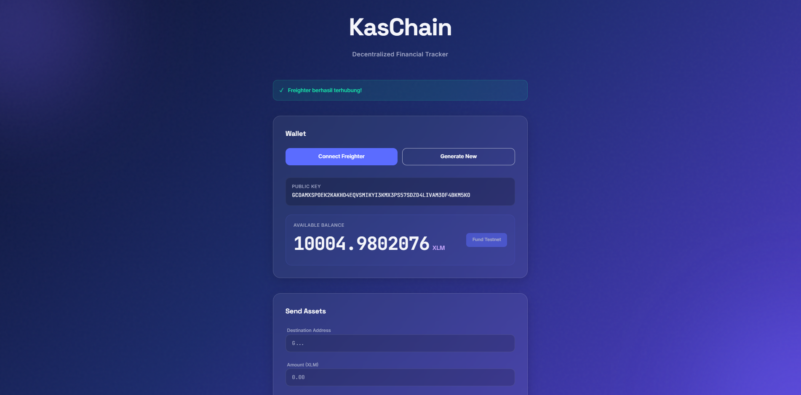
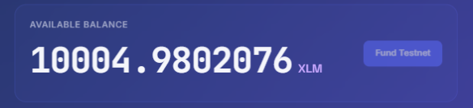
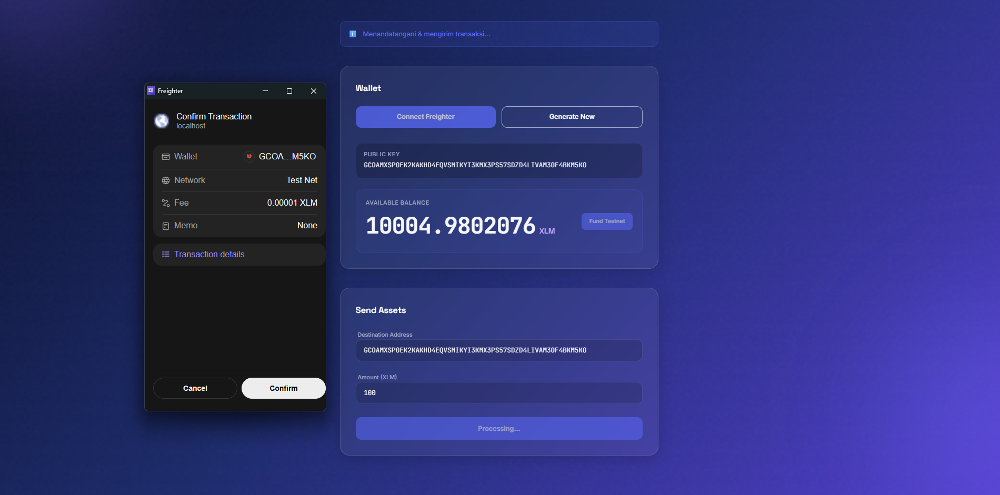
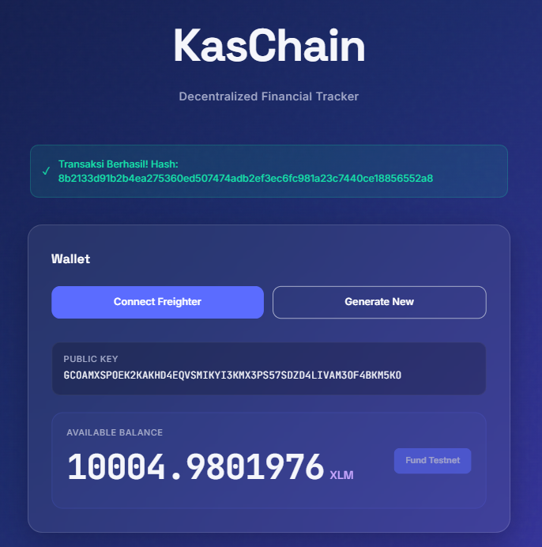

<div align="center">
  <h1>✨ KasChain</h1>
  <p><strong>Decentralized Financial Tracker Powered by AI & Web3</strong></p>
</div>

---

## 📌 About KasChain

**KasChain** is an AI-based (Google Gemini) and Web3 (Stellar blockchain) financial tracking application specifically designed to bring transparency to shared funds (Kas Bersama) in organizations, communities, or individuals.

By combining artificial intelligence to facilitate data input through natural conversation (NLP) and the reliability of the Stellar blockchain for immutable data transparency, KasChain elevates financial management to a more modern, secure, and user-friendly level.

## 🚀 Key Features (Level 2)

- **🤖 AI-Powered Input:** Type your transaction as if you are chatting (e.g., *"Bought lunch for 35k"*), and Gemini AI extracts the data into a structured JSON format.
- **🔗 Web3 Transparency (Smart Contract):** Every critical transaction is recorded into a Soroban Smart Contract on the Stellar Testnet. Features **custom errors** for invalid amounts and flows.
- **💳 Multi-Wallet Support:** Connect seamlessly using the Stellar Wallets Kit. Supports Freighter, xBull, and Albedo.
- **🔥 Firebase Firestore:** Real-time data synchronization for the user's dashboard.
- **🧊 Modern Glassmorphism UI:** A premium, transparent, and responsive user interface representing Transparency.

## 🛠 Tech Stack

- **Frontend:** React (Vite), Tailwind CSS
- **AI Integration:** Google Gemini API (`gemini-2.5-flash`)
- **Blockchain / Web3:** Stellar Testnet (Soroban), `@stellar/stellar-sdk`, `@creit.tech/stellar-wallets-kit`
- **Database / Sync:** Firebase Firestore (Realtime Sync)

## 🗺 Development Roadmap (Belt System)

KasChain is built incrementally using the Rise In Belt progression system:

1. **⚪️ White Belt (Foundation):** Wallet creation, basic Stellar interactions (Friendbot, balance check, send XLM).
2. **🟡 Yellow Belt (Integration):** Addition of basic AI Chat (Gemini), Firestore integration, and basic transaction logging *Smart Contract* (`TransactionLogger`).
3. **🟠 Orange Belt (Shared Treasury):** Decentralized *Group Ledger* with member invitation features and on-chain shared balance tracking.
4. **🟢 Green Belt (Production-Ready):** AI refinements, multi-sig transaction authorization features (Requires Approval), and *Dashboard Analytics*.
5. **🔵 Blue Belt (Growth):** Focus on onboarding the first 50+ users and iterating based on real *feedback*.
6. **⚫️ Black Belt (Mainnet):** Launch on Stellar Mainnet, security audit, and addition of *advanced* features (real payments/fiat-on-ramp).

## 💻 How to Run Locally

### Prerequisites
- Node.js (v18+ recommended)
- Freighter Wallet Extension (Installed in your browser)

### Installation & Setup

1. **Clone the Repository:**
   ```bash
   git clone <repo-url>
   cd kaschain/frontend
   ```

2. **Install Dependencies:**
   ```bash
   npm install
   ```

3. **Set Up Environment Variables:**
   Create a `.env` file in the `frontend` folder and add the following variables:
   ```env
   VITE_HORIZON_URL=https://horizon-testnet.stellar.org
   VITE_STELLAR_NETWORK=TESTNET
   VITE_GEMINI_API_KEY=your_gemini_api_key_here
   ```

4. **Run the Development Server:**
   ```bash
   npm run dev
   ```
   The application can be accessed at `http://localhost:5173`.

## 📜 Smart Contract (Soroban)

The Rust-based *smart contract* code can be found in the `contracts/kaschain/` directory. This contract acts as a _Transaction Logger_ to ensure every recorded expense or income cannot be silently deleted or modified.

To compile the *smart contract*:
```bash
cd contracts/kaschain
cargo build --target wasm32-unknown-unknown --release
```

## 📸 Screenshots (Submission Requirements)

Here are the screenshots demonstrating the core functionality of the application at this stage:

### 1. Wallet Connected State

 

### 2. Balance Displayed

 

### 3. Successful Testnet Transaction

 

### 4. Transaction Result Shown to the User

 

---
*KasChain — Realizing financial transparency for every community through the power of AI and Web3.*
